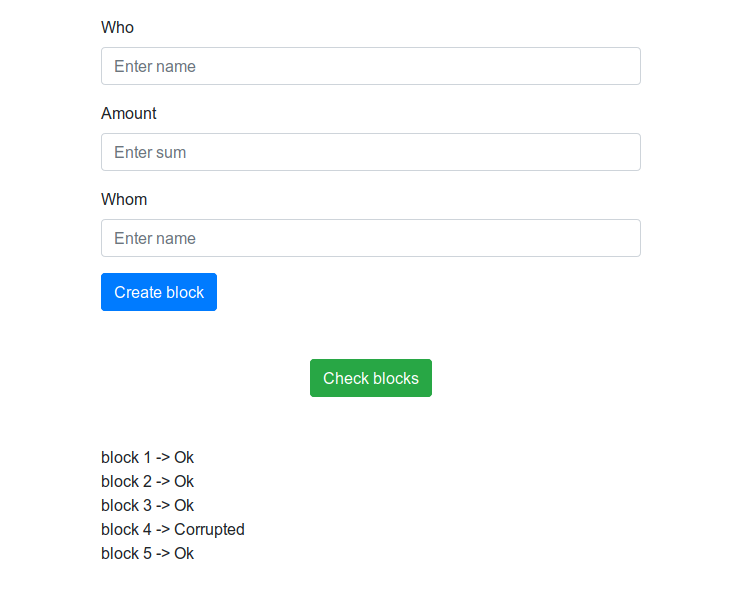

# simple_blockchain

This is a simple example of how blockchain works. In the blockchain_transact directory, we have incremental files that contain the hash of the previous file.

The **write_file_transact** function in block.py module is creating a new file

To check the chain of hashes in files, you need to use the **check_blocks_hash** function

If the file contents was changed, the function **check_blocks_hash** will mark the file as corrupted.
